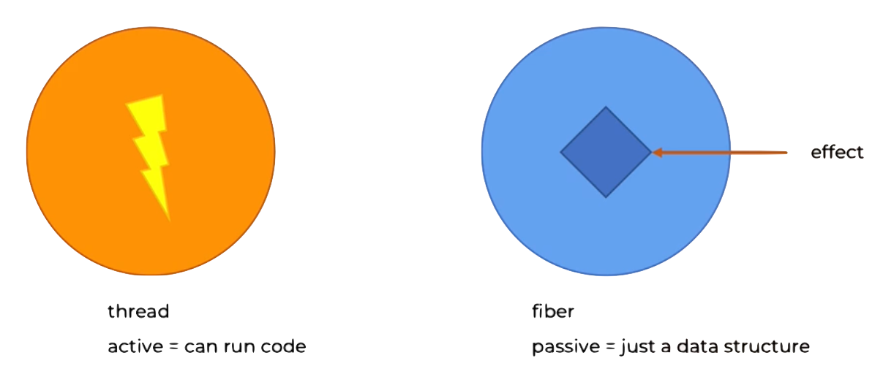
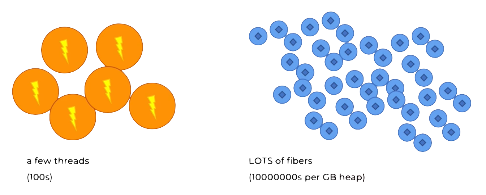

# How Fibers Work

## Concurrency vs Parallelism

- Parallelism = multiple computations running at the same time
- Concurrency = multiple computations overlap

#### Parallel program may not necessarily be concurrent
- e.g. the tasks are independent

#### Concurrent programs may not necessarily be parallel
- e.g. multi-tasking on the same CPU (i.e. tine-slicing)

We focus on _concurrency_
- poses the most problems
- is almost always a requirement for useful programs

## Fibers

```scala 3 mdoc:invisible
import rtj.all.{*, given}
import cats.effect.{Fiber, IO}

val meaningOfLife = IO(42)
```

#### Fiber = description of an effect being executed on some other thread

```scala 3 mdoc
def createFiber: Fiber[IO, Throwable, String] = ???
```

A `Fiber` type constructor features 3 type parameters:
- the effect type i.e. `IO`
- the failure type e.g. `Throwable`
- the result type e.g. `String`

Creating a fiber is an effectful operation
- the fiber will be wrapped in IO

```scala 3 mdoc
val aFiber: IO[Fiber[IO, Throwable, Int]] = meaningOfLife.start
```

Managing a fiber is an effectful operation
- the result of the operation is wrapped in another IO

```scala mdoc
def runInSomeOtherThread[A](io: IO[A]): IO[Outcome[IO, Throwable, A]] = for {
  ioF <- io.start
  result <- fib.join
} yield result
```

## Thread vs Fiber

### How Fibers Work

Cats Effect has a thread-pool that manages the execution of effects...



Cats Effect schedules fibers for execution...



## Motivation for Fibers

### Why we need fibers

- no more need for threads and locks
- delegate thres managemetn to Cats Effect (CE)
- avoid synchronous code with callbacks (callback hell)
  - very contentious: `flatMap`, `traverse`, etc is the callback pattern i.e. via HOFs 
- maintain pure functional programming
- keep low-level primitives e.g. blocking, waiting, joining, interrupting, cancelling

### Fiber scheduling concepts & implementation details

- blocking effects in a fiber lead to deschuduling
- semantic blocking
- cooperative scheduling
- the same fiber can run on multiple JVM threads
- work-stealing thread pool