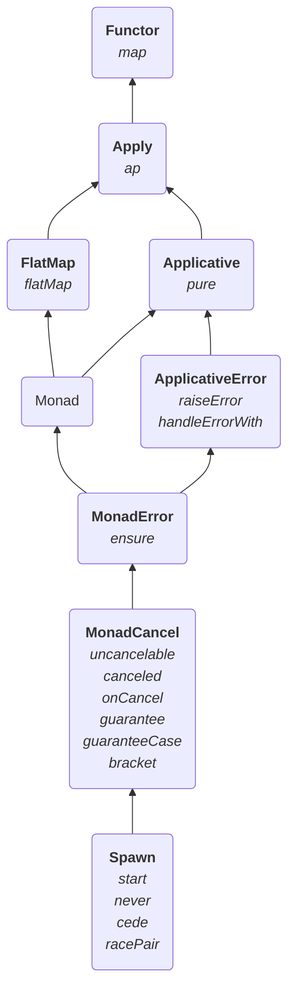

# Polymorphic Fibers

## Spawn = the ability to create any effects on fibers

```scala 3 mdoc:invisible
import rtj.all.{*, given}
import cats.effect.{Fiber, MonadCancel, Outcomel}
```

```scala 3 mdoc
trait GenSpawn[F[_], E] extends MonadCancel[F, E] {
  def start[A](fa: F[A]): F[Fiber[F, E, A]] // creates a fiber
  def never[A]: F[A] // a forever-suspending effect
  def cede: F[Unit] // a "yield" effect

  def racePair[A, B](fa: F[A], fb: F[B]): F[Either[ // fundamental racing
    (Outcome[F, E, A], Fiber[F, E, B]),
    (Fiber[F, E, A], Outcome[F, E, B])
  ]]
}
```

# Type Class Hierarchy


