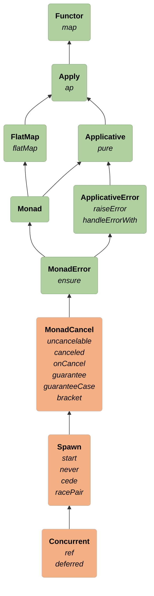

# Polymorphic Coordination

## Concurrent = the ability to create concurrency primitives

- `Ref` and `Deferred` are the basic primitives
- Can create everything else in terms of them (e.g. `Mutex`, `CyclicBarrier`, `CountDownLatch`, etc)

```scala 3 mdoc:invisible
import rtj.all.{*, given}
import cats.effect.{Deferred, Ref, Spawn}
```

```scala 3 mdoc
trait Concurrent[F[_]] extends Spawn[F] {
  def ref[A](a: A): F[Ref[F, A]]
  def deferred[A]: F[Deferred[F, A]]
}
```

### Goal: generalize concurrent code for any effect type

# Type Class Hierarchy


