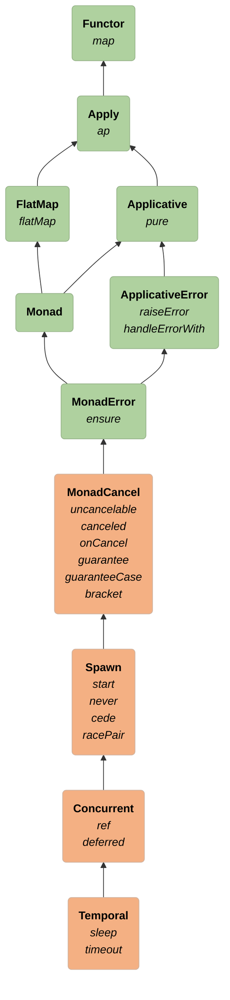

# Polymorphic Temporal

## Temporal = the ability to create time-limited blocking effects

- Fundamental operation: `sleep`
- Extra functionality unlocked: `timeout`

```scala 3 mdoc:invisible
import cats.effect.Concurrent
import scala.concurrent.duration.FiniteDuration
```

```scala 3 mdoc
trait Temporal[F[_]] extends Concurrent[F] {
  def sleep(time: FiniteDuration): F[Unit] // semantically blocks this fiber for a specified time
}
```

### Goal: generalize time-based code for any effect type

# Type Class Hierarchy


