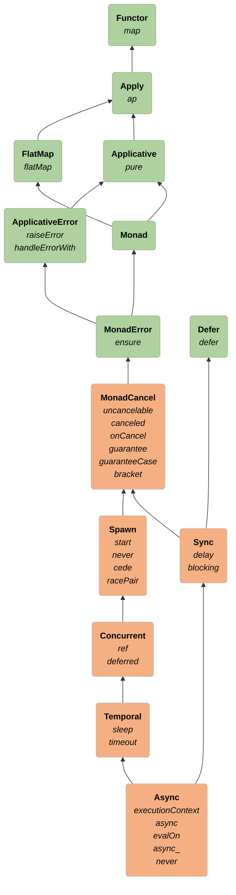

# Polymorphic Asynchronous

## Async = the ability to suspend asynchronous effects from outside Cats Effect

- `delay` = wrapping any computation in `F`
- `blocking` = a semantically blocking computation, wrapped in `F`

```scala 3 mdoc:invisible
import cats.Defer
import cats.effect.MonadCancel
```

```scala 3 mdoc
trait Async[F[_]] extends Sync[F] with Temporal[F] {
  def executionContext: F[ExecutionContext]
  def async[A](cb: (Either[Throwable, A] => Unit) => F[Option[F[Unit]]]): F[A]
  def evalOn[A](fa: F[A], ec: ExecutionContext): F[A]

  def async_[A](cb: (Either[Throwable, A] => Unit) => Unit): F[A] =
    async { cb_ => as(delay(cb(cb_)), None) }
  // never-ending effect
  def never[A]: F[A] =
    async(_ => pure(None))
}
```

### Goal: generalize asynchronous code for any effect type
- Foreign Function Interface (FFI): suspending computations (including side-effects) executed in another context
- Most powerful type-class in Cats-Effect

# Type Class Hierarchy


