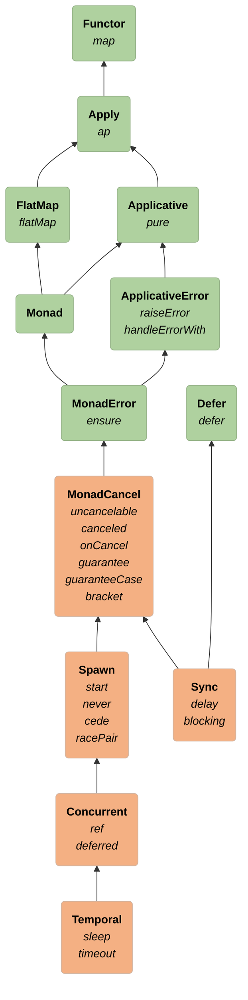

# Polymorphic Synchronous

## Sync = the ability to suspend effects synchronously

- `delay` = wrapping any computation in `F`
- `blocking` = a semantically blocking computation, wrapped in `F`

```scala 3 mdoc:invisible
import cats.Defer
import cats.effect.MonadCancel
```

```scala 3 mdoc
trait Sync[F[_]] extends MonadCancel[F, Throwable] with Defer[F] {
  def delay[A](thunk: => A): F[A] // "suspension" of a computation - will run on the CE thread pool
  def blocking[A](thunk: => A): F[A] // runs on the blocking thread pool

  // defer comes for free
  def defer[A](fa: => F[A]): F[A] = flatten(delay(fa))
}
```

### Goal: generalize synchronous code for any effect type
- Foreign Function Interface (FFI): suspending computations (including side-effects) executed in another context

# Type Class Hierarchy


